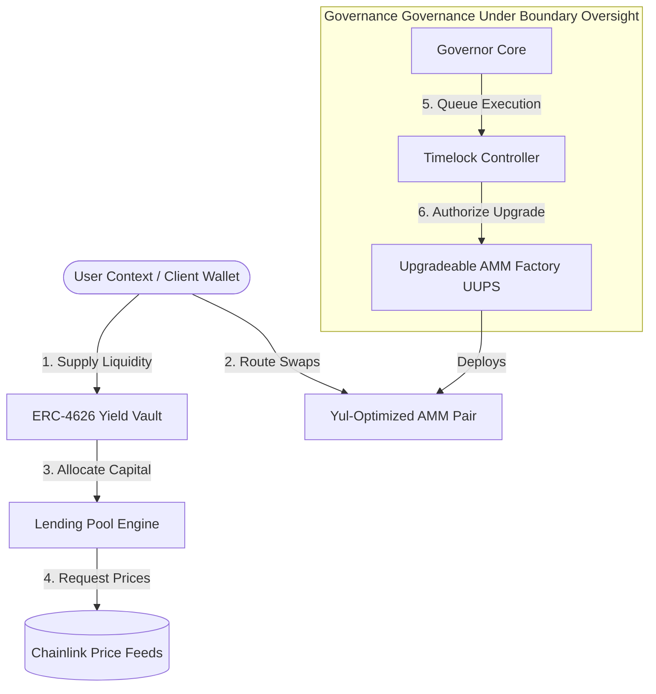

# DeFi Super-App Protocol — Full-Stack Capstone

## 1. Project Overview & Scope
This repository contains the production-grade decentralized architecture for our Full-Stack DeFi Super-App, serving as the capstone project for Blockchain Technologies 2. 

The protocol natively synthesizes three core financial primitives into an optimized, interconnected Layer 2 ecosystem:
1. **Automated Market Maker (AMM):** A constant-product x * y = k pool architecture using gas-optimized Yul blocks and programmable deployment logic via factory contracts.
2. **Lending Protocol:** An over-collateralized lending and borrowing engine with real-time risk metrics managed via automated health factors and Chainlink Price Feeds.
3. **Tokenized Yield Vault:** A fully compliant ERC-4626 yield-bearing vault maximizing asset utilization across underlying lending protocol mechanisms.

---

## 2. Team Structure & Clear Areas of Ownership
In alignment with Section 1.1 of the project requirements, each team member maintains strict individual ownership over core architecture, logic streams, and delivery pipelines:

### Person 1: Protocol Architect & Lead Engineer
* **Core Focus:** Core Smart Contract Architecture, Advanced Solidity Patterns, Optimization, and CI/CD pipelines.
* **Owned Component Deliverables:**
  * Core DeFi Logic: Constant-product AMM core engine (`AMMPair.sol`, `AMMFactory.sol`).
  * Advanced Patterns: Multi-method deployment factory using both `CREATE` and `CREATE2` opcodes; upgradeable architecture via the Universal Upgradeable Proxy Standard (UUPS).
  * Assembly Optimization: Localized Yul assembly blocks written and benchmarked for mathematical operations (e.g., `sqrt`).
  * L2 DevOps: Network deployment setups for Layer 2 Testnets (Arbitrum/Base Sepolia) alongside automated GitHub Actions quality gates.
  * Automation Engine: Configured automated code formatting (`forge fmt`), linting (`solhint`), and strict security scanning via Crytic Slither.

### Person 2: Financial Engineer & Cryptographer
* **Core Focus:** Yield Aggregation, Mathematical Core Logic, and End-to-End Cryptographic Invariants.
* **Owned Component Deliverables:**
  * Yield Mechanism: Native Tokenized Yield Vault implementation following the official EIP-4626 standard.
  * Algorithmic Logic: Multi-asset lending pool mechanism defining user health factors, collateralization ratios, and liquidation handlers.
  * Security Invariants: Creation of invariant test suites and fuzz testing vectors (`testFuzz_...`) ensuring the preservation of pool ratios and constant-product formulas under adversarial conditions.

### Person 3: Full-Stack Engineer & Data Architect
* **Core Focus:** Client-Side Applications, Blockchain Indexing, and Decentralized Governance Frameworks.
* **Owned Component Deliverables:**
  * Data Indexing: Complete Subgraph design using AssemblyScript handlers to index factory events and serve historical market data.
  * Decentralized Governance: Custom Timelock controller and Governor setups (based on OpenZeppelin standards) granting the community administrative rights over proxy implementations.
  * Frontend Application: Fully responsive React/Next.js dashboard integrating Web3 client frameworks (Wagmi/Viem) to query Subgraph endpoints and execute smart contract transactions.

---

## 3. Protocol Architecture & System Design

### 3.1 Component Interconnectivity Diagram
The system layout establishes an automated feedback loop where user liquidity is tokenized, aggregated, routed to lending primitives, and fully managed under the oversight of a DAO framework:



---

## 4 Local Environment Setup

### 4.1 IDE setup
To build, format, lint, and run the protocol testing suite locally, execute the following commands in your terminal:

```bash
# Clone the repository
git clone [https://github.com/Casper-242464/BlockChain2Final.git](https://github.com/Casper-242464/BlockChain2Final.git)
cd BlockChain2Final

# Install dependencies (Foundry / OpenZeppelin)
forge install

# Run the local compilation check
forge build
```

### 4.2 Website setup
For this part you will need to use several terminal windows.
1. In the first terminal to deploy a local blockchain node

```bash 
anvil
```

2. In the second terminal deploy our contracts to the local node. Then copy the contract addresses from the output and paste them into the frontend/src/contracts.js 
```bash
forge script script/DeployLocal.s.sol --rpc-url http://127.0.0.1:8545 --broadcast
```

3. Finally, in the third terminal deploy the website itself
```bash
cd frontend
npm run dev
```

## 5. Project Documentation & Deliverables 
Detailed technical specifications and gas optimization benchmarks are available in the docs directory: 
* [Architecture & Design Document](docs/architecture-design.md) — A deep dive into the system layout, component interconnectivity, and security design.
* [Gas Optimization Report](docs/gas-optimization-report.md) — Comparative analysis and benchmarks between Solidity and Yul mathematical primitives.
* [security Audit Report](docs/security-audit-report.md) — The internal security review of the DeFi SuperApp
